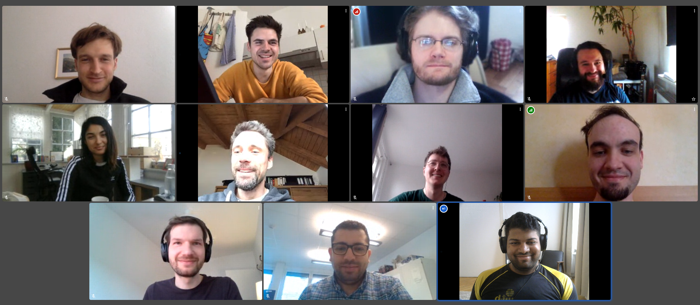

The Landgraf Lab works at the interface of biology and computer science to study the collective intelligence of model organisms (bees and fish). To understand how the various interactions between the members of a group lead to emergent group properties, we develop modern tools such as tracking systems or biomimetic robots. Using these tools, we have been able to record large and unique data sets. An integral part of the lab is the development of interpretable machine learning models that provide explanations as to what they have learned. This ultimately informs new hypotheses, new experiments and new tools to be developed in the future.

##  Collaborators

* [Prof. Dr. Jens Krause](https://www.igb-berlin.de/en/profile/jens-krause) – Biologie und Ökologie der Fische, IGB Berlin and HU Berlin
* [Dr. David Bierbach](http://www.davidbierbach.com/) - HU Berlin
* [Prof. Dr. Dr. h.c. Randolf Menzel](https://www.bcp.fu-berlin.de/en/biologie/arbeitsgruppen/neurobiologie/ag_menzel/index.html) – Neurobiology, FU Berlin
* [Prof. Dr. Martin Paul Nawrot](https://neuroscience.uni-koeln.de/neuroforum/ag-nawrot) – Neuroinformatik, Uni Köln
* [Prof. Dr. Gerhard von der Emde](https://www.zoologie.uni-bonn.de/abteilungen/neuroethologie-sensorische-oekologie-prof.-g.-von-der-emde), Neuroethology, Uni Bonn
* [Prof. Dr. Iain Couzin](https://collectivebehaviour.com/people/couzin-iain/) - MPI Animal Behavior and Uni Konstanz
* [Prof. Dr. Michael Smith](https://smithbeelab.com/pages/people/) - Auburn University
* [Prof. Dr. Christoph Benzmüller](http://page.mi.fu-berlin.de/cbenzmueller/) - FU Berlin
* [Prof. Dr. Ralf Romeike](https://www.mi.fu-berlin.de/inf/groups/ag-ddi/team/prof/rromeike.html) - FU Berlin
