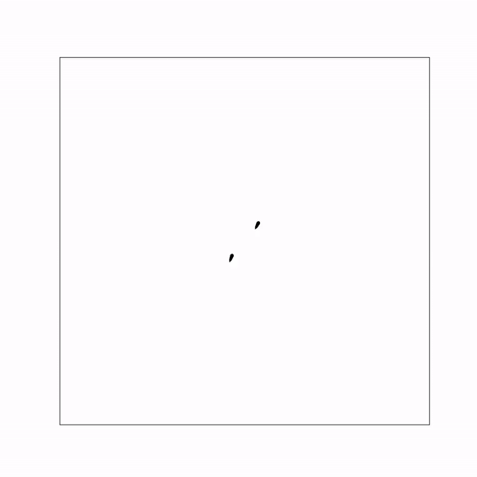
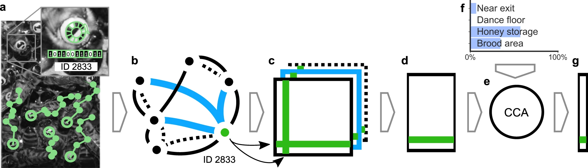
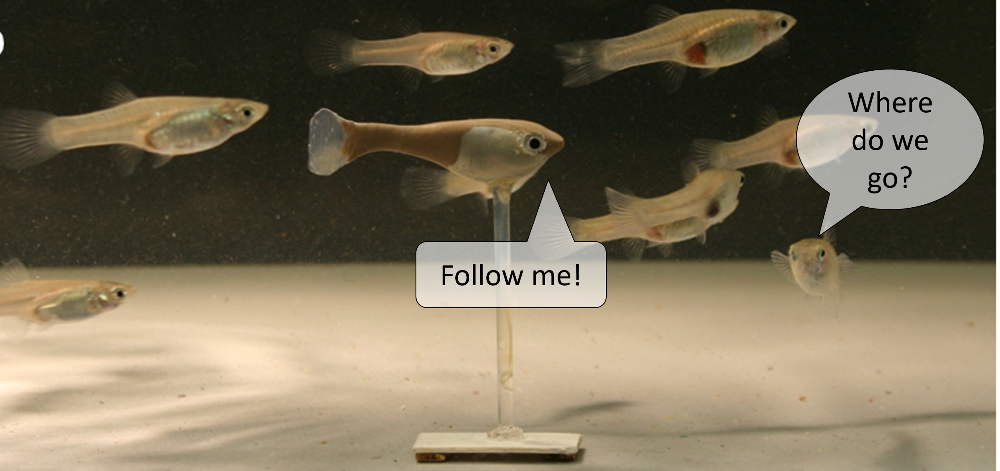

Everything is connected. The nature of the world is much like a dense network of connected nodes, whether it may be molecules that interact, humans that communicate or weather systems that influence each other.

The Landgraf lab studies complex <i>social</i> systems - collectives made of individual living units that each observe their environment, learn what’s good and bad, and interact with conspecifics. These interactions (and how they change over time) often create emergent properties on the group level: from coordinated motion patterns of flocks and shoals to the democratic decision making process in humans. The whole is greater than the sum of its parts - but exactly <i>how</i>?

### Research Dimension 1: Models of Individual Behavior

To understand how collectives can be smart and how group patterns emerge, we often simplify the system, creating models that represent how we <i>think</i> each individual works: Does it have a memory of past events? How is an observation of the environment translated to behavior? Rather than using the human brain to come up with a model, a part of the Landgraf lab is concerned with (machine) learning models of individual behavior. How can we leverage large amounts of data to extract a model that not only is as accurate but also as generic as possible? How can we control the level of abstraction and how can we make sure we humans learn something about the actual living system and not just about our model?

**Figure:** *A neural network was trained to imitate tracking data of pairs of female Guppys. The gif shows a simulation of two (identical) networks interacting in a virtual tank. Video created by Marc Gröhling.*

### Research Dimension 2: Models of Group Behavior
Similarly, we can use machine learning to come up with a model that reflects the general properties of the group dynamics (rather than using the individual models to simulate a group). Looking at many hundred or thousand honeybees, for example, we have been able to study life-long social networks and learn about different interaction patterns bees produce when performing one of the many roles there are in a colony. Now, we can invert this idea: knowing with whom you meet tells us something about your task in the collective!

**Figure:** *With our bee tracking system "BeesBook", we obtained lifetime tracking data for several thousand bees (a). These tracks are used to construct multiple weighted social interaction networks (b). We aggregate daily networks (c) to then extract embeddings that group bees together with similar interaction patterns, using spectral decomposition (d). Finally, we use a linear transformation (e; CCA canonical-correlation analysis) that maximizes correlation with the fraction of time spent in different nest areas (f) to compress them into a single number per day called “network age” (g). Figure taken from [(Wild et al. 2021)](https://www.nature.com/articles/s41467-021-21212-5).*

### Research Dimension 3: Robots that interact with the living system
Coming up with some model isn’t that hard. It’s showing whether it is valid or under which circumstances it may not. Among many established methods we have invested much time in creating physical animal models that look and act like their animal counterparts. These biomimetic robots can observe the real environment and act upon it. This way, we can learn about how different actions affect the group for example. Robots can be used for a wide variety of questions and applications. We have used quadrocopters to record neural activity of bees that were flown over real-world scenes, or model cars to test whether exchanging energy between electric cars can help reduce range anxiety.

**Figure:** *We have built robotic guppys that can interact with live fish in real-time. In one of our works we studied which adaptive strategies fish may employ to optimize their leadership performance when interaction partners may exhibit an (unknown) personality profile.*

### Research Dimension 4: Explainabilty and Interpretability

Modern machine learning models (i.e. deep neural networks, DNNs) are powerful. They can learn virtually any mapping between input-output pairs. Whether we use DNNs to learn individual or collective behavior from data, or use DNNs in predicting cardiovascular risk, we would like some explanation as to why the model does what it does. Did the model use spurious correlations, or which features did it use?

**Figure:** *To understand which input regions were relevant for the decision of a image classification network, we recently proposed restricting the amount of information that is allowed to flow through the network with so-called information bottlenecks. We introduce as much random noise into the activations of early network layers as possible without impairing the classification result. Those areas that received much noise are irrelevant!*

### Funding and Sponsoring

    <table>
        <thead>
            <th>Time Frame</th>
            <th>Acronym</th>
            <th>Title of Project</th>
            <th>Funding Body</th>
        </thead>
        <tbody>
            <tr>
                <td> 2021 - 2024</td>
                <td>PetraKIP</td>
                <td>Persönliches transparentes KI-basiertes Portfolio für die Lehrerbildung</td>
                <td></td>
            </tr>
            <tr>
                <td>2020 - 2023</td>
                <td>ElektroFish</td>
                <td>Roboter, die mit Fischen kommunizieren: Untersuchung der Rolle elektrischer Signale und Bewegungsmustern nach Episoden gegenseitiger Aufmerksamkeit bei schwach elektrischen Fischen</td>
                <td></td>
            </tr>
            <tr>
                <td>2019 - 2021</td>
                <td>BrainRL</td>
                <td>Learning the Language of the Brain: Adaptive Brain-Machine Interfaces Maximize Information Transfer Through Autonomous Interaction with Brain Tissue</td>
                <td></td>
            </tr>
            <tr>
                <td>2019 - 2024</td>
                <td>Hiveopolis</td>
                <td>Futuristic Beehives for a smart Metropolis</td>
                <td></td>
            </tr>
            <tr>
                <td>2017 - 2021</td>
                <td>RoboFish</td>
                <td>Mixed Shoals of Live Fish and Interactive Robots for the Analysis of Collective Behavior in Fish</td>
                <td></td>
            </tr>
            <tr>
                <td>2016 - 2021</td>
                <td>NeuroCopter</td>
                <td>Robotik in der Neurobiologie: Ziele finden mit einem winzigen Gehirn. Die neuronalen Grundlagen der Navigation der Bienen.</td>
                <td></td>
            </tr>
        </tbody>
    </table>

